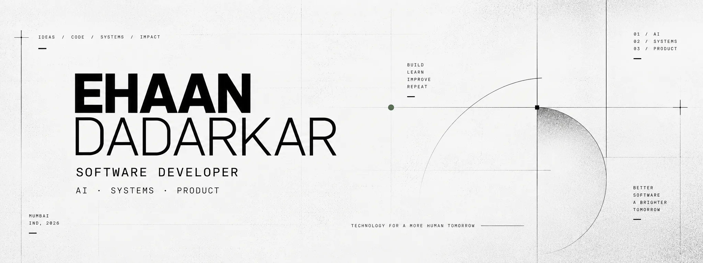
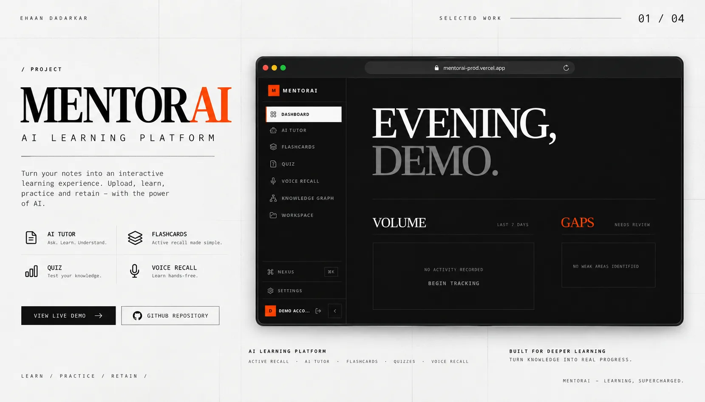
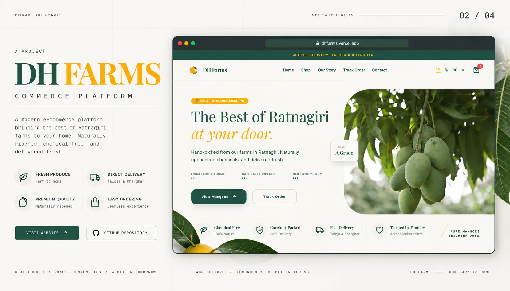
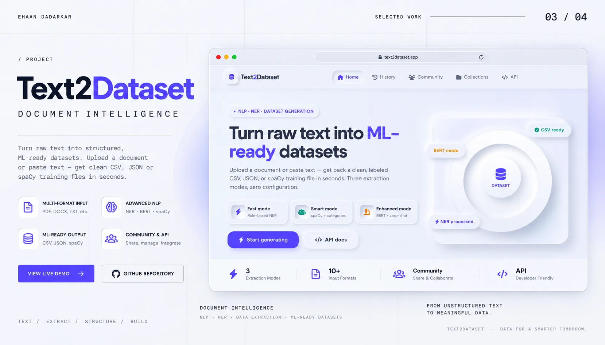
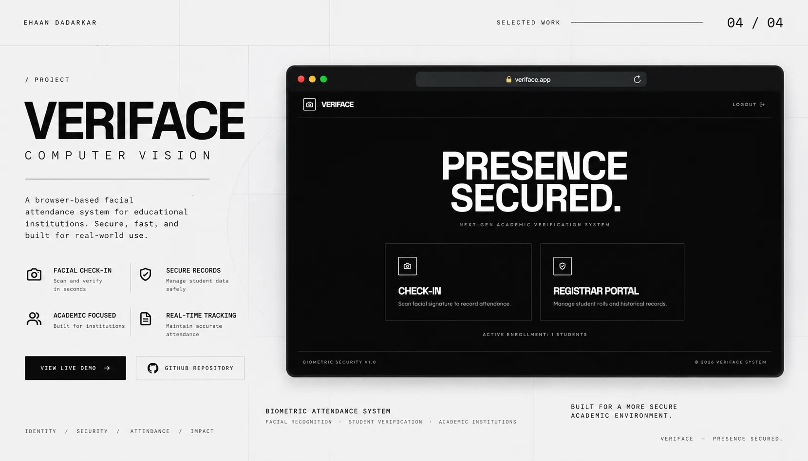

  

# Ehaan Dadarkar

**Software Developer · AI Engineer**

I build full-stack products, AI systems, and automation.

   &nbsp;
   &nbsp;
  

  

  

  

---

`01 — ABOUT`

## About

Engineering is how I think. Shipping is how I learn.

I build software around real problems — from full-stack products and AI-powered systems to automation and developer tooling. I care about turning ideas into systems that are useful, maintainable, and actually shipped.

My work lives at the intersection of product engineering, AI systems, and developer tooling — focused on building things that are clear in intent, solid in execution, and ready for real use.

`02 — CAPABILITY`

## What I Build

**AI Engineering:**
Integrating AI systems into practical, real-world products.

**Full-Stack Products:**
Web applications from interface to backend — product thinking from day one.

**Automation:**
Workflows that reduce friction and scale independently.

**Developer Systems:**
Tools and infrastructure that improve how software gets built.

---

`03 — SELECTED WORK`

## Selected Work

`01 / MENTORAI — AI LEARNING PLATFORM`

  

AI Learning Platform for Active Recall and Adaptive Learning — built as an editorial, dark-mode learning environment.

   &nbsp;
  

---

`02 / DH FARMS — COMMERCE PLATFORM`

  

Modern Agricultural E-Commerce Platform — warm, premium commerce with organic product narratives.

   &nbsp;
  

---

`03 / TEXT2DATASET — DOCUMENT INTELLIGENCE`

  

AI Document Intelligence and Dataset Extraction Platform — turning unstructured documents into usable datasets.

  

---

`04 / VERIFACE — COMPUTER VISION`

  

Browser-based Facial Attendance System — a monochrome biometric system with strong typographic identity.

   &nbsp;
  

  

`04 — FOCUS`

## Current Focus

- **01 — AI System Design** · AI-native application development.
- **02 — Backend Engineering** · Systems and APIs.
- **03 — Automation** · AI automation and workflows.
- **04 — Product Engineering** · From idea to shipped product.

---

`05 — STACK`

## Technical Stack

**Frontend:**
React · Next.js · TypeScript · JavaScript · Tailwind CSS · Vite.

**Backend:**
Node.js · Express · Python · FastAPI.

**Data:**
PostgreSQL · Supabase · MongoDB · MySQL.

**AI:**
LLM APIs · AI Integration · AI Automation.

**Infrastructure:**
Git · GitHub · Vercel · Docker.

  

`06 — ACTIVITY`

## Contribution

  

  Contribution graph — updated daily. Native GitHub activity reflects real shipping cadence.

  

  Built with intent — less, but intentional.

