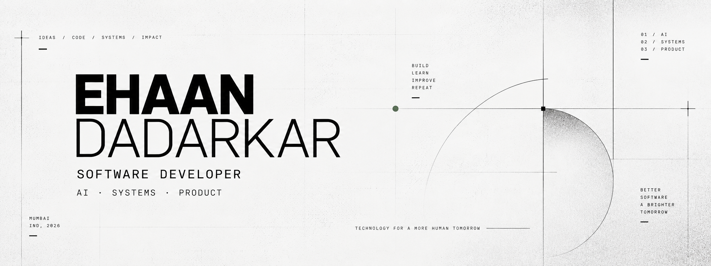
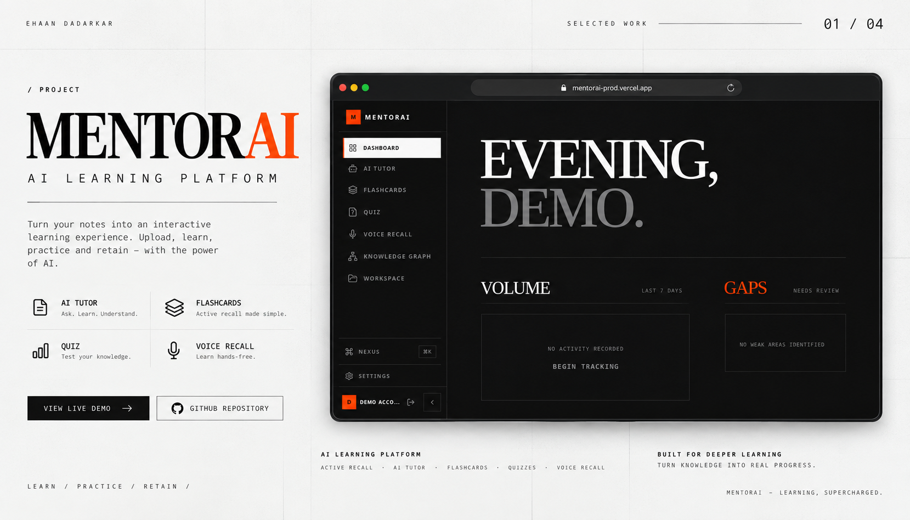
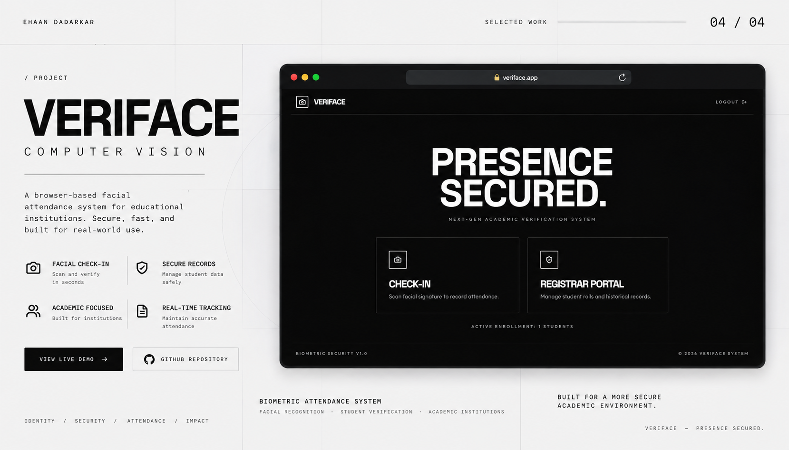

  

# Ehaan Dadarkar

**Software Developer · AI Engineer**

I build full-stack products, AI systems, and automation.

  <a href="https://ed-port.vercel.app/">Portfolio</a> &nbsp;·&nbsp;
  <a href="https://github.com/Ehaan-Dadarkar">GitHub</a> &nbsp;·&nbsp;
  <a href="https://linkedin.com/in/ehaan-dadarkar-1694a8351">LinkedIn</a>

  

  

  

---

01 — ABOUT

## About

Engineering is how I think. Shipping is how I learn.

I build software around real problems — from full-stack products and AI-powered systems to automation and developer tooling. I care about turning ideas into systems that are useful, maintainable, and actually shipped.

My work lives at the intersection of product engineering, AI systems, and developer tooling — focused on building things that are clear in intent, solid in execution, and ready for real use.

---

02 — WHAT I BUILD

## What I Build

**AI ENGINEERING**
Integrating AI systems into practical real-world products.

**FULL-STACK PRODUCTS**
Web applications from interface to backend — product thinking from day one.

**AUTOMATION**
Workflows that reduce friction and scale independently.

**DEVELOPER SYSTEMS**
Tools and infrastructure that improve how software gets built.

---

03 — SELECTED WORK

## Selected Work

### 01 — MentorAI

  

**AI Learning Platform**

AI Learning Platform for Active Recall & Adaptive Learning.

  <a href="https://github.com/Ehaan-Dadarkar/MentorAI">Repository</a> &nbsp;·&nbsp;
  <a href="https://mentorai-prod.vercel.app/">Live Demo</a>

---

### 02 — DH Farms

  

**Commerce Platform**

Modern Agricultural E-Commerce Platform.

  <a href="https://github.com/Ehaan-Dadarkar/DHFarms">Repository</a> &nbsp;·&nbsp;
  <a href="https://dhfarms.vercel.app/">Live Demo</a>

---

### 03 — Text2Dataset

  

**Document Intelligence**

AI Document Intelligence & Dataset Extraction Platform.

  <a href="https://github.com/Ehaan-Dadarkar/Text2Dataset">Repository</a>

---

### 04 — VeriFace

  

**Computer Vision**

Browser-Based Facial Attendance System.

  <a href="https://github.com/Ehaan-Dadarkar/Veriface">Repository</a> &nbsp;·&nbsp;
  <a href="https://veriface-prod.vercel.app/">Live Demo</a>

---

04 — CURRENT FOCUS

## Current Focus

<table>
  <tr>
    <td width="50%">
      01 
      <strong>AI System Design</strong> 
      AI-native application development
    </td>
    <td width="50%">
      02 
      <strong>Backend Engineering</strong> 
      Systems and APIs
    </td>
  </tr>
  <tr>
    <td width="50%">
      03 
      <strong>Automation</strong> 
      AI automation and workflows
    </td>
    <td width="50%">
      04 
      <strong>Product Engineering</strong> 
      From idea to shipped product
    </td>
  </tr>
</table>

---

05 — TECHNICAL STACK

## Technical Stack

**FRONTEND**
React · Next.js · TypeScript · JavaScript · HTML · CSS · Tailwind CSS · Bootstrap · Vite

**BACKEND**
Node.js · Express · Python · FastAPI · REST APIs

**DATA**
PostgreSQL · Supabase · MongoDB · MySQL

**AI**
LLM APIs · AI Integration · AI Automation · OpenAI API

**INFRASTRUCTURE**
Git · GitHub · Vercel · Docker

  

  

  

---

06 — GITHUB

## GitHub Activity

  

  

---

07 — CONNECT

## Connect

<a href="https://ed-port.vercel.app/">Portfolio</a> — ed-port.vercel.app 
<a href="https://github.com/Ehaan-Dadarkar">GitHub</a> — github.com/Ehaan-Dadarkar 
<a href="https://linkedin.com/in/ehaan-dadarkar-1694a8351">LinkedIn</a> — linkedin.com/in/ehaan-dadarkar-1694a8351

---

  

